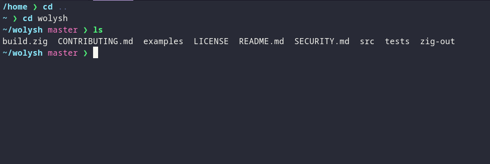
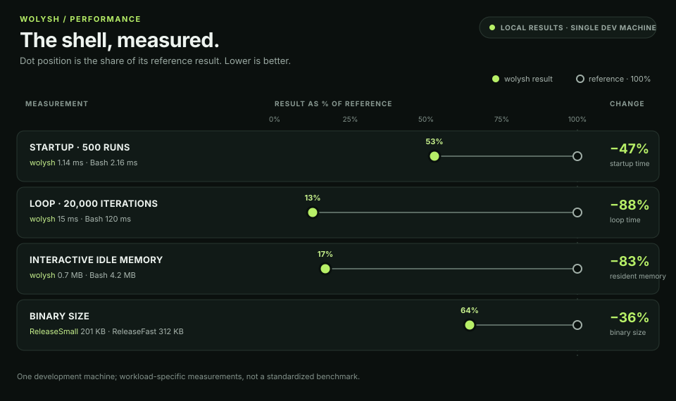

<p></p>

# wolysh (`wsh`)

**A fast, readable Linux shell built to grow into a fish/Bash alternative.**

wolysh combines everyday Linux commands with a readable scripting language.
Commands stay commands; arithmetic, conditions, loops, and functions get their
own syntax. It is written in Zig and uses native Linux process and job control.

## Download

**[Get the latest Linux x86_64 release](https://github.com/dev-dami/wolysh/releases/latest)**

The release archive includes the shell, examples, license, and checksum.



## Why wolysh

- Run familiar commands, pipes, redirects, and globs.
- Merge stderr with stdout, feed commands with here-documents, and isolate work in subshells.
- Write scripts with expressions, `if`, loops, and functions.
- Use built-in completion, syntax highlighting, history suggestions, and `Ctrl-R`.
- Get typo suggestions with a Bloom-style prefilter; normal command lookup
  skips fuzzy work.
- Cache recent misses for fast inline corrections on the next attempt.
- Use quick `la` and `lh` shortcuts for common `ls` options.
- Manage foreground/background jobs with `Ctrl-Z`, `bg`, and `fg`.

```text
let workers = 4 * 2
if workers > 4 {
    print "Building with $workers workers"
    cargo build --jobs $workers
}
```

## Performance snapshot



Measurements are from one development machine, not a standardized benchmark.
The loop result covers this 20,000-iteration workload; results vary by machine
and workload.

<details>
<summary>Build from source</summary>

Linux x86_64 is the currently tested target. Building requires Zig 0.16.0:

```sh
zig build -Doptimize=ReleaseFast
./zig-out/bin/wsh
```

To install the source build, run `sudo install -m 0755 zig-out/bin/wsh /usr/local/bin/wsh`.

</details>

## Project status

Early stage and not a Bash or POSIX drop-in. Current gaps include `$((...))`
and brace expansion. See the [language guide](docs/language.md)
for features, configuration, key bindings, and known limitations.

- [Contributing](CONTRIBUTING.md)
- [Security policy](SECURITY.md)
- [Demo script](examples/demo.wsh)

## License

MIT. See [LICENSE](LICENSE).
