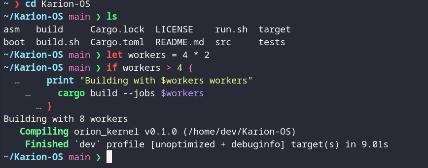
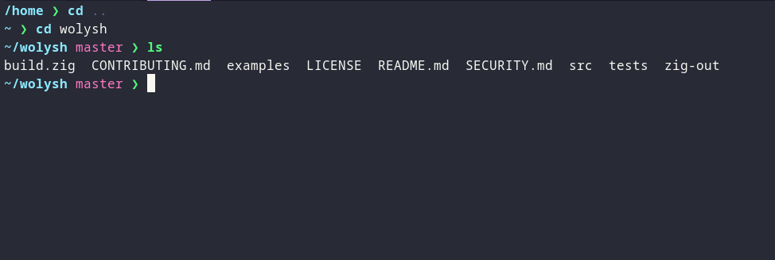
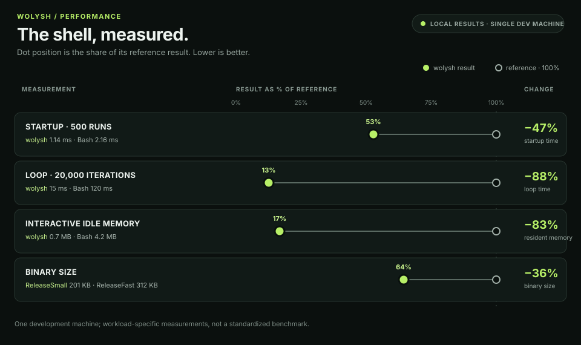

<p></p>

# wolysh (`wsh`)

**A fast, readable Linux shell for developers and agent workflows.**

wolysh combines everyday Linux commands with a readable scripting language.
Commands stay commands; arithmetic, conditions, loops, and functions get their
own syntax. It is written in Zig and uses native Linux process and job control.

## Download

**[Get the latest Linux x86_64 release](https://github.com/dev-dami/wolysh/releases/latest)**

The release archive includes the shell, examples, license, and checksum.

<p></p>

<details>
<summary>Interactive prompt</summary>
<p></p>
</details>

## Why wolysh

- Run familiar commands, pipes, redirects, and globs.
- Merge stderr with stdout, feed commands with here-documents, and isolate work in subshells.
- Write scripts with expressions, `if`, loops, and functions.
- Use built-in completion, syntax highlighting, history suggestions, and `Ctrl-R`.
- Get typo suggestions with a Bloom-style prefilter; normal command lookup
  skips fuzzy work.
- Cache recent misses for fast inline corrections on the next attempt.
- Use quick `la` and `lh` shortcuts for common `ls` options.
- Manage foreground/background jobs with `Ctrl-Z`, `bg`, and `fg`.
- Run independent tasks with native `parallel -j N`, fail-fast queueing,
  and JSONL task reports.
- Check generated scripts with `wsh --check` before executing them.

```text
let workers = 4 * 2
if workers > 4 {
    print "Building with $workers workers"
    cargo build --jobs $workers
}
```

## Performance snapshot



Measurements are from one development machine, not a standardized benchmark.
The loop result covers this 20,000-iteration workload; results vary by machine
and workload.

The [repeatable benchmark suite](benchmarks/README.md) compares the current
worktree, the previous release, and Bash with interleaved samples. It covers
startup, arithmetic, external commands, pipelines, event-driven waits, and
bounded parallel tasks.

## Agent and developer workflows

Build once with `zig build -Doptimize=ReleaseFast`, then invoke the native
binary directly. Non-interactive commands skip prompt, history, and config
loading:

```sh
./zig-out/bin/wsh --check script.wsh
./zig-out/bin/wsh --no-config -c "parallel -j 2 --fail-fast --report checks.jsonl 'zig build check' 'zig build -Doptimize=ReleaseFast'"
```

`parallel` runs Wolysh command strings in isolated child processes, inherits
functions and variables, and refills a slot as soon as a task finishes. Reports
record task indexes, exit statuses, and elapsed times separately from command
output. See the [agent workflow guide](docs/agent-workflows.md) for the contract
and examples.

<details>
<summary>Build from source</summary>

Linux x86_64 is the currently tested target. Building requires Zig 0.16.0:

```sh
zig build -Doptimize=ReleaseFast
./zig-out/bin/wsh
```

To install the source build, run `sudo install -m 0755 zig-out/bin/wsh /usr/local/bin/wsh`.

For a user-local installation without sudo:

```sh
zig build -Doptimize=ReleaseFast --prefix "$HOME/.local"
"$HOME/.local/bin/wsh" --version
```

Add `$HOME/.local/bin` to your existing shell's `PATH` if it is not already there.

</details>

## Project status

Early stage and not a Bash or POSIX drop-in. Arithmetic expansion `$((...))`,
brace expansion, `<<-`/`<<<` inputs, and the common builtins are in place;
missing pieces include POSIX control flow (`if cmd; then`, `case`, `until`),
process substitution `<( )`, the `${name:=}` / `${name:?}` / pattern-removal
parameter operators, and extended globbing. See the
[language guide](docs/language.md) for features, configuration, key bindings,
and the current limitations.

Recent changes are recorded in the [changelog](CHANGELOG.md).

- [Contributing](CONTRIBUTING.md)
- [Security policy](SECURITY.md)
- [Demo script](examples/demo.wsh)

## License

MIT. See [LICENSE](LICENSE).
